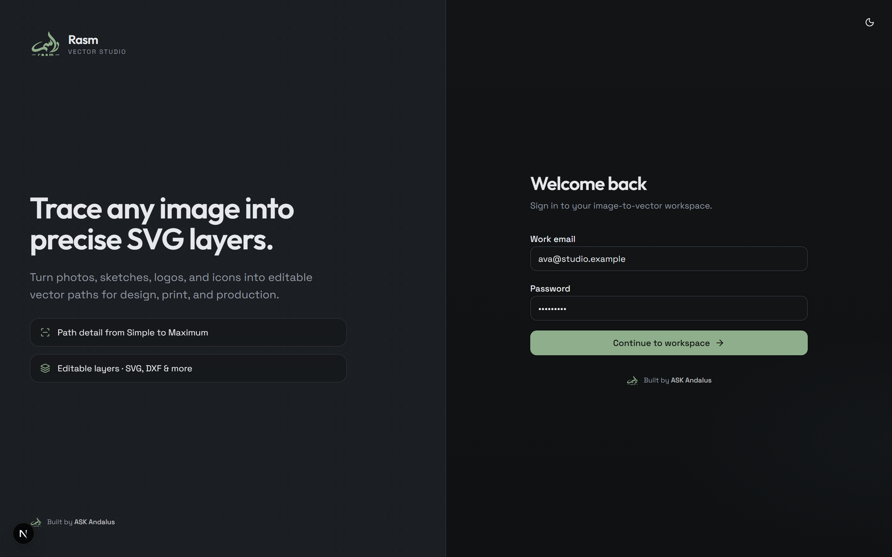
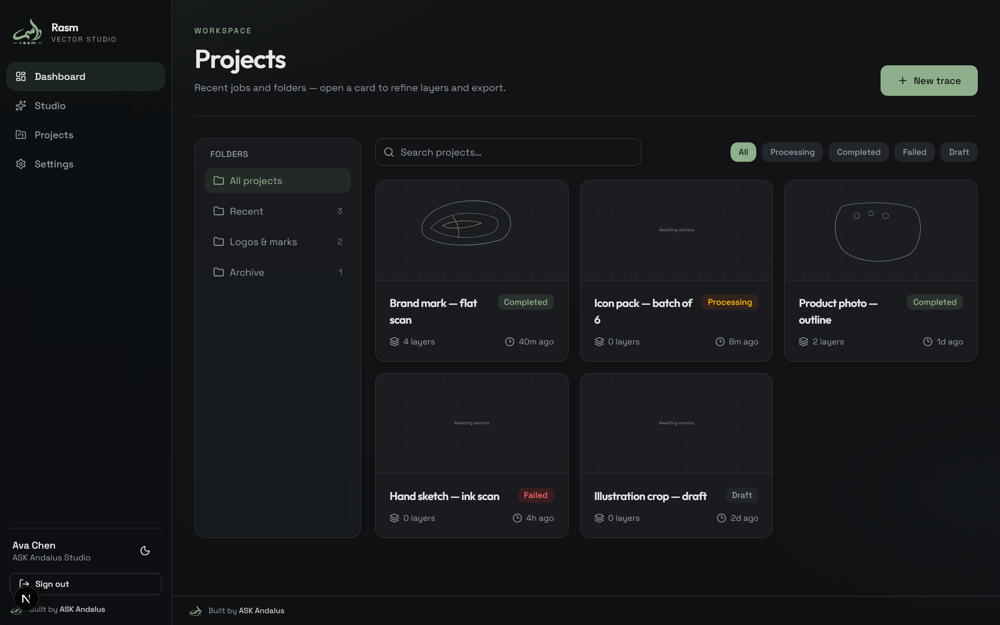
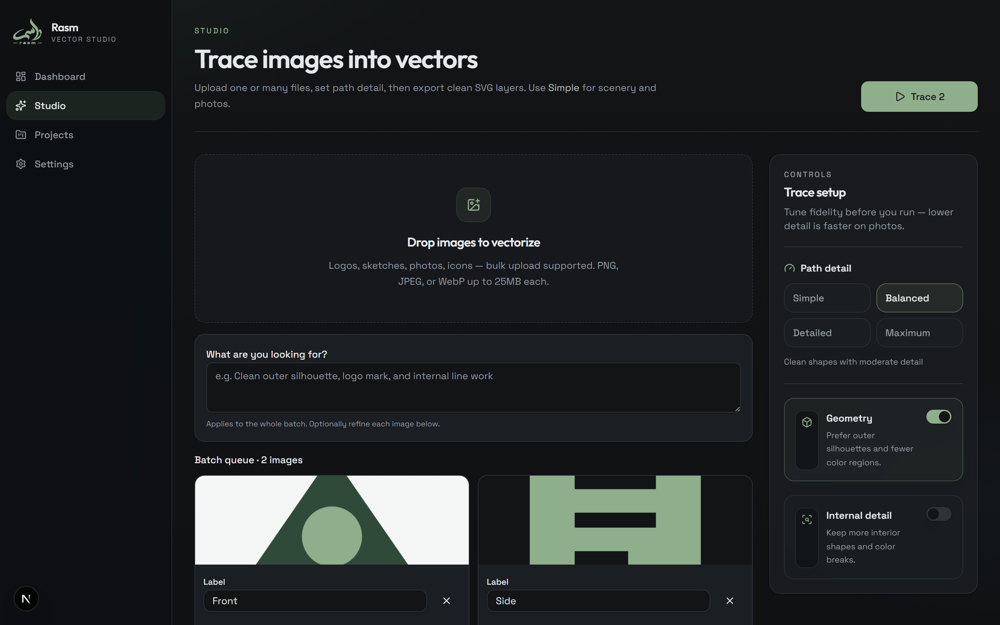
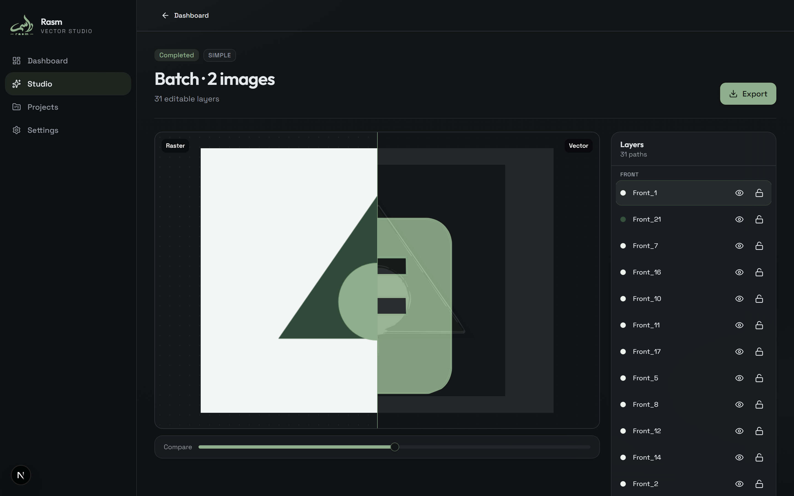

<p align="center">
  
</p>

<h1 align="center">Rasm</h1>

<p align="center">
  <strong>Image → editable SVG layers</strong><br />
  A browser-native vector studio for logos, sketches, icons, and photos.
</p>

<p align="center">
  Built by <a href="https://github.com/ahmadsk-cell">ASK Andalus</a>
  ·
  <a href="guides/HOW_TO_USE_RASM.md">User guide</a>
  ·
  <a href="docs/CASE_STUDY.md">Case study</a>
</p>

---

## Product shots

Captured from the live app (`npm run capture:case-study`).

### Sign-in



### Project workspace



### Studio — upload, path detail, and batch queue



### Vector workspace — raster / vector compare + layers



---

## Why Rasm

Most “image to SVG” tools either over-trace noisy photos into thousands of useless paths, or hide the process behind a black box. Rasm is built as a **studio**:

- **Path detail** — Simple → Maximum, so scenery stays fast and logos can stay sharp
- **Geometry / internal detail modes** — bias toward silhouettes or interior breaks
- **Layered output** — toggle, lock, and export paths as SVG / DXF / JSON
- **In-browser tracing** — no Python service required for the default pipeline

---

## Features

| Area | What you get |
| --- | --- |
| Upload | Bulk PNG / JPEG / WebP dropzone with per-image notes |
| Trace controls | Path detail presets + Geometry / Internal detail toggles |
| Workspace | Split raster↔vector compare, layer panel, tuning sliders |
| Export | SVG, DXF, JSON, and AI-friendly package |
| Projects | Foldered dashboard with status filters |
| Auth | Demo workspace sign-in (swap-ready for Clerk / NextAuth) |

---

## Stack

- **Next.js 16** (App Router) + TypeScript  
- **Tailwind CSS 4** + Radix / Shadcn-style primitives  
- **Framer Motion** · **Zustand** · **react-dropzone** · **Sonner**  
- Tracing: [ImageTracer](https://github.com/jankovicsandras/imagetracerjs) in the browser  
- Optional: `VECTOR_SERVICE_URL` proxy for a heavier CV microservice  

---

## Quick start

```bash
npm install
npm run dev
```

Open [http://localhost:3000](http://localhost:3000) → sign in on `/login` → **Studio**.

Demo password field accepts any value; auth is local demo state.

### Scripts

```bash
npm run dev                 # local development
npm run build               # production build
npm run start               # serve production build
npm run lint                # eslint
npm run capture:case-study  # regenerate docs/screenshots (app must be running)
```

---

## App map

| Route | Description |
| --- | --- |
| `/login` | Workspace sign-in |
| `/dashboard` | Projects, folders, status filters |
| `/studio` | Upload, path detail, batch intent |
| `/studio/[projectId]` | Compare view, layers, export |
| `/settings` | Workspace + about / credits |
| `POST /api/vectorize` | Optional upstream CV proxy |

---

## Vector engine notes

Studio traces **in the browser**: color quantization → contour paths → SVG layers.

**Path detail presets** resize and simplify before tracing:

| Level | Best for |
| --- | --- |
| **Simple** | Photos, scenery, fast silhouettes |
| **Balanced** | Default — most logos & product shots |
| **Detailed** | Finer regions / more color breaks |
| **Maximum** | Highest fidelity (slow on complex images) |

Plain-language walkthrough: **[guides/HOW_TO_USE_RASM.md](guides/HOW_TO_USE_RASM.md)**  
Longer product write-up: **[docs/CASE_STUDY.md](docs/CASE_STUDY.md)**

---

## Credits

**Rasm** is built by [ASK Andalus](https://github.com/ahmadsk-cell).

If this is useful, star the repo or open an issue with a sample image that misbehaves — path detail presets are tuned against real studio uploads.
